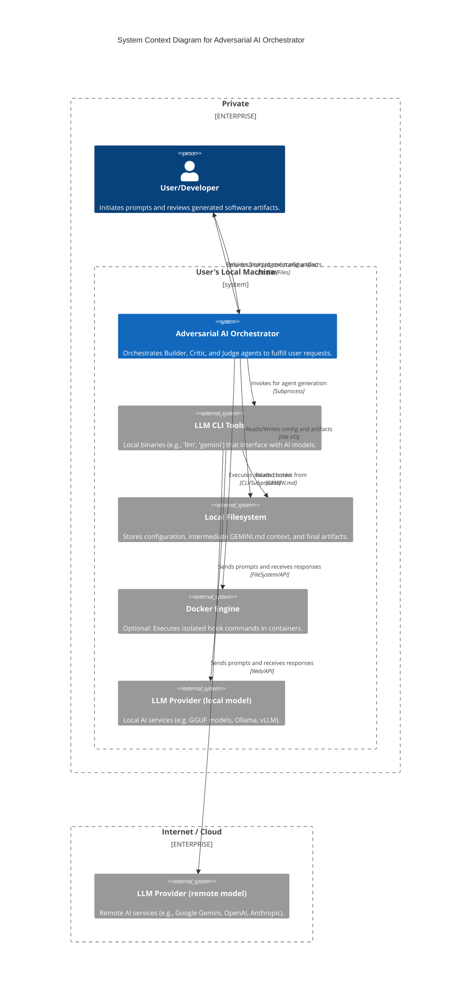

# C4 Context Diagram: Adversarial AI Orchestrator

This diagram provides a high-level view of the Adversarial AI Orchestration system and how it interacts with users and external systems.

## Actors & Systems

### User/Developer
The primary actor who interacts with the system via the command line. They provide the initial prompt and consume the final implementation.

### Adversarial AI Orchestrator (The System)
The core Python application. It manages the lifecycle of a request by routing prompts through a three-stage adversarial pipeline (Builder -> Critic -> Judge). It is responsible for state management, hook execution, and artifact collection.

### LLM CLI Tools (External)
The system is designed to be agnostic of the specific LLM. It delegates the actual "thinking" to external CLI tools like Simon Willison's `llm` or the `gemini` CLI. This abstraction enables a **Hybrid LLM Strategy**:
- **Local Models**: You can use tools that interface with local engines (e.g., Ollama, vLLM, GGUF) for maximum privacy, lower latency, and zero cost.
- **Cloud Models**: You can use enterprise-grade models (e.g., Gemini 1.5 Pro, GPT-4) when high-reasoning capability is required.
- **Mixed/Isolated Usage**: Because each agent (Builder, Critic, Judge) can be configured independently, you can mix providers—for example, using a fast local model for the Builder and a powerful cloud model for the final Judge.

### LLM Providers (Local & Cloud)
- **Local Provider**: Resides within the private boundary of the user's machine. Ideal for development and sensitive code.
- **Cloud Provider**: Accessed over the internet via APIs. Provides access to the latest frontier models.

### Local Filesystem (External)
The primary persistence and communication layer.
- **Config**: Defined in `config.json`.
- **Context Swapping**: The system uses `GEMINI.md` as a "working memory" for certain CLI tools.
- **Artifacts**: Final outputs are stored in the `artifacts/` directory.

### Docker Engine (External)
An optional dependency used to provide environment isolation for hooks. This is specifically used when identity switching (`uid`/`gid`) is required or when a specific runtime (e.g., `node`, `python`) is needed for a hook without polluting the host system.
