# Operational Sequences: Adversarial AI Orchestrator

This document details the step-by-step execution flow of the Adversarial AI Orchestrator. It illustrates how the system coordinates hooks, context management, and external LLM calls.

## Macro-Level Orchestration Flow

The following diagram shows the complete lifecycle of a single user prompt as it moves through the three-stage adversarial pipeline.

```mermaid
---
config:
  theme: dark
---
sequenceDiagram
    autonumber
    actor User
    participant Orch as Orchestrator
    participant Hook as HookExecutor
    participant FS as Local Filesystem
    participant LLM as LLMWrapper (CLI)

    User->>Orch: Run(prompt)

    Orch->>Hook: run_hook("pre_router")
    Orch->>Orch: route(prompt)
    Orch->>Hook: run_hook("post_router")

    rect rgb(40, 40, 40)
        Note over Orch, FS: Builder Stage
        Orch->>Hook: run_hook("pre_builder")
        Orch->>FS: _swap_context(builder_sys)
        Orch->>LLM: generate(builder_sys, user_prompt)
        LLM-->>Orch: builder_output
        Orch->>FS: _restore_context()
        Orch->>Hook: run_hook("post_builder")
    end

    rect rgb(50, 50, 50)
        Note over Orch, FS: Critic Stage
        Orch->>Hook: run_hook("pre_critic")
        Orch->>FS: _swap_context(critic_sys)
        Orch->>LLM: generate(critic_sys, builder_output)
        LLM-->>Orch: critic_output
        Orch->>FS: _restore_context()
        Orch->>Hook: run_hook("post_critic")
    end

    rect rgb(60, 60, 60)
        Note over Orch, FS: Judge Stage
        Orch->>Hook: run_hook("pre_judge")
        Orch->>FS: _swap_context(judge_sys)
        Orch->>LLM: generate(judge_sys, critic_output)
        LLM-->>Orch: judge_output
        Orch->>FS: _restore_context()
        Orch->>Hook: run_hook("post_judge")
    end

    Orch->>Hook: run_hook("finished")
    Orch->>FS: save_artifacts(outputs)
    Orch-->>User: Display Final Judgment
```

## Participant Roles in the Flow

### Orchestrator (The Conductor)
The central authority. It maintains the state of the conversation (outputs from previous stages) and ensures that the filesystem context (`GEMINI.md`) is correctly set up and torn down before and after each LLM call.

### HookExecutor (The Environment Manager)
Runs user-defined commands at specific lifecycle events. This allows for automated setup (e.g., creating directories) or post-processing (e.g., running linters on generated code) without modifying the core Python logic.

### LLMWrapper / CLI (The Intelligence Interface)
Acts as a stateless bridge to the Large Language Models. It is responsible for constructing the correct CLI arguments and enforcing timeouts. It does not know about the "pipeline"—it only knows how to turn a single prompt into a single response.

### Local Filesystem (The Shared Memory)
Used for two critical purposes:
1.  **Ephemeral Context**: For certain LLM tools (like `gemini` CLI), the filesystem acts as a transient bridge via the `GEMINI.md` file. It is swapped in/out during each stage.
2.  **Persistence**: Final results from all stages are saved as Markdown files in the `artifacts/` folder for review.
